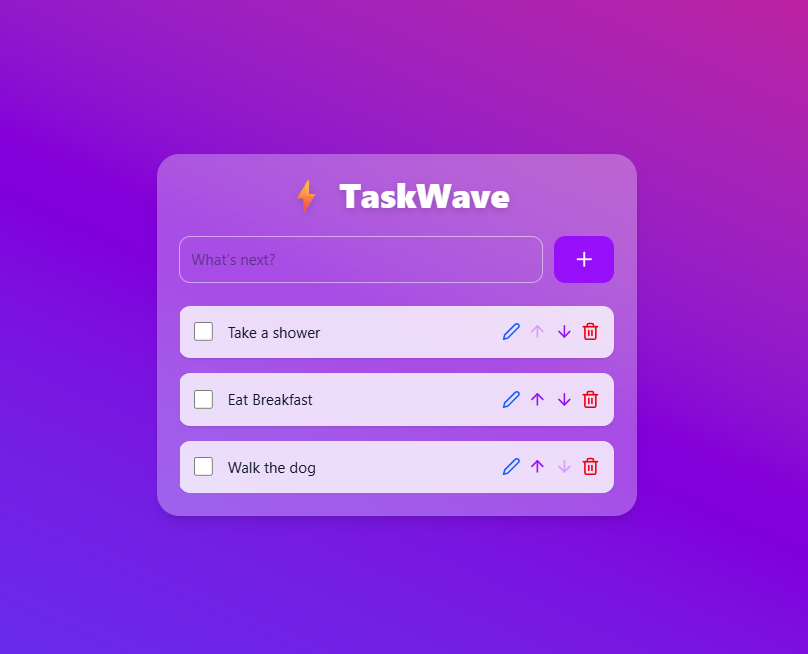

# ⚡ TaskWave – Todo App

A modern, animated, and responsive **Todo List application** built with **React**, **Tailwind CSS**, and **Framer Motion**.  
Easily add, edit, complete, reorder, and delete your tasks — all stored locally in your browser for quick access.

---
<div align="center">

## 🚀 Live Demo  
🔗 [Run Live](https://todolistbyizzu.netlify.app/)
<br><br>


</div>
 


---

## ✨ Features

- 📝 **Add New Tasks** – Quick input with `Enter` key or click.
- ✅ **Mark as Completed** – Checkbox to toggle completion state.
- ✏️ **Edit Tasks** – Double-click or use the edit icon.
- ⬆️⬇️ **Reorder Tasks** – Move tasks up or down in the list.
- 🗑️ **Delete Tasks** – Remove unwanted tasks instantly.
- 💾 **Persistent Storage** – Data saved in `localStorage`.
- 🎨 **Beautiful UI** – Glassmorphism design with smooth animations using Framer Motion.
- 📱 **Responsive** – Works seamlessly on desktop, tablet, and mobile.

---

## 🛠️ Tech Stack

- **Frontend:** [React](https://reactjs.org/)  
- **Styling:** [Tailwind CSS](https://tailwindcss.com/)  
- **Animations:** [Framer Motion](https://www.framer.com/motion/)  
- **Icons:** [React Icons](https://react-icons.github.io/react-icons/)  
- **Storage:** `localStorage`
---

## ⚡ Getting Started

### 1️⃣ Clone the Repository
```bash
git clone https://github.com/yourusername/todo-app.git
cd todo-app
````

### 2️⃣ Install Dependencies

```bash
npm install
```

### 3️⃣ Start Development Server

```bash
npm run dev
```

### 4️⃣ Build for Production

```bash
npm run build
```

---

## 📌 Usage Tips

* **Add Tasks:** Type in the input and press `Enter` or click ➕.
* **Edit Tasks:** Double-click on a task or click ✏️.
* **Reorder:** Use ⬆️ / ⬇️ arrows.
* **Delete:** Click 🗑️ icon.

---
free to use and modify.
---
